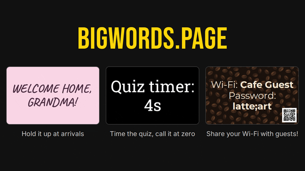

# BIGWORDS.PAGE

Full-screen text for any screen. Type a message in the editor and it fills the screen, as big as it fits. The whole display lives in the URL, so there's no backend, no accounts and nothing stored on a server.

<picture>
  <source media="(prefers-reduced-motion: reduce)" srcset="docs/media/demo-poster.png">
  
</picture>

## Using it

- **Editor** `/editor`: write the message and set colors, fonts, slides, countdowns, animations and QR codes with a live preview. **Copy URL** copies the display link, and the QR button shows it as a code, so you can open it on a phone, tablet or TV by scanning.
- **Viewer** `/#…`: the display itself, fullscreen, with no controls. This is the link you share, bookmark or open on the screen.
- **Docs** `/docs`: the reference, built from [`docs/REFERENCE.md`](docs/REFERENCE.md). All of the URL parameters are documented, so generating links is easy.

Features:

- Text fits itself to any screen size and orientation
- A small Markdown subset: bold, italic, headings, line breaks
- Slides, split with `||`
- Countdowns to a date and time (`until`) or for a length of time (`timer`)
- Animations, bundled open-source fonts and aspect-ratio framing
- QR codes drawn in the browser: links, Wi-Fi, calls, texts, email, locations
- Images, and keeping the screen awake while a display is open

The display lives in the URL fragment (after the `#`), which browsers never send to the server.

## Self-hosting

The build is a folder of static files, so any static host works if it serves `index.html` for `/`, `editor.html` for `/editor`, `docs.html` for `/docs`, and `404.html` with status 404 for any other path. If your host sends a Content-Security-Policy, copy the `script-src` from the [`Caddyfile`](Caddyfile): `index.html` has one inline script, allowed by its hash. The supported way to run it is the Docker image.

### Docker

The image is the official `caddy` image serving the build from `/usr/share/caddy`, with a Caddyfile that listens on `:80`, sets the security headers and serves `404.html` for unknown paths.

```sh
git clone https://github.com/SpeakingOfBrad/BIGWORDS.PAGE.git
cd BIGWORDS.PAGE
docker compose up -d --build
```

`compose.yaml` publishes no ports (port 80 is listed but commented out). Attach the service to your reverse proxy's network and let the proxy handle TLS. The proxy should also send `Strict-Transport-Security`.

The image keeps the stock Caddy defaults, including running as root, so it behaves like any other `caddy` container. The site is static and holds no secrets, but if you want to lock the container down further, these compose settings work with it:

```yaml
services:
  bigwords:
    read_only: true
    tmpfs:
      - /data
      - /config
    cap_drop: [ALL]
    cap_add: [NET_BIND_SERVICE] # needed to listen on :80
    security_opt: [no-new-privileges:true]
    mem_limit: 128m
    cpus: 0.5
```

To run as a non-root user as well, change the Caddyfile to listen on a port above 1024 (for example `:8080`), add `user: "1000:1000"`, and point your proxy and the Dockerfile `HEALTHCHECK` at the new port.

### Build settings

All optional. Set them as environment variables for `npm run build`, or as build args in `compose.yaml` (`build.args`) or `docker build --build-arg`.

| Setting | Effect |
|---|---|
| `SITE_URL` | Your public origin, e.g. `https://signs.example.com`. Adds canonical URLs, Open Graph/Twitter image tags, home page JSON-LD and `sitemap.xml`, all of which need an absolute URL. Without it they're left out. |
| `NOINDEX` | `1` adds `noindex` to every page, makes `robots.txt` disallow everything and drops the sitemap. For staging copies and private instances. |
| `OPERATOR_DOCS` | Path to a Markdown file appended to `/docs`, for notes about your instance, such as who runs it and how to report abuse. Relative to the repository root. |

## Development

Requires Node 22.12+. CI and the Docker build use the LTS release in [`.node-version`](.node-version), currently 24.

```sh
npm install
npm run dev        # dev server
npm test           # unit tests (Vitest)
npm run typecheck
npm run build      # static output in dist/
npm run preview    # serve dist/ on :4173
npm run smoke      # browser smoke test against the preview server (Playwright)
npm run clipcheck  # checks that no glyph ink is clipped at the text area edges
```

GitHub Actions ([`.github/workflows/ci.yml`](.github/workflows/ci.yml)) runs the unit tests, build and smoke test on every push to `main` and every pull request. Clipcheck runs too, but its result doesn't fail the build.

The social card `public/og.png`, the app icons (`public/apple-touch-icon.png`, `public/icon-*.png`) and the install screenshots (`public/screenshots/`) are rendered by `npm run og` (with `npm run preview` running) and committed. Re-run it after changing the fonts, the favicon or the editor's look. The editor screenshots show `SITE_URL` in the URL field, or `example.com` without it.

Project layout:

| Path | Purpose |
|---|---|
| `src/state/` | Fragment parsing/serialization, parameter validation and defaults |
| `src/render/text.ts` | Message pipeline: escapes → slides → markdown → `{countdown}` |
| `src/render/display.ts` | The renderer shared by the viewer, editor preview and home page |
| `src/editor/` | Editor UI |
| `docs/REFERENCE.md` | Documentation source, rendered into `/docs` at build time |
| `public/fonts/` | Vendored fonts with their licenses (`npm run fonts` regenerates them) |

## License

[MIT](LICENSE). Bundled fonts and libraries keep their own licenses; see [THIRD_PARTY_NOTICES.md](THIRD_PARTY_NOTICES.md).
